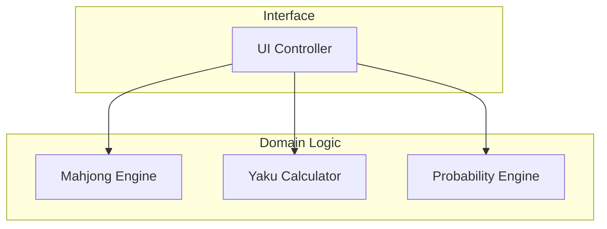

# アーキテクチャ ドキュメント

## 概要

このアプリケーションは、ユーザーインターフェース（UI）とコアとなるドメインロジックを分離した、クリーンでモジュール化されたアーキテクチャを採用しています。パフォーマンスと科学的な正確さを重視して設計された、クライアントサイドのJavaScriptアプリケーションです。

## コアコンポーネント

システムは主に4つのコンポーネントで構成されています：

1.  **UI Controller** (`src/ui/ui-controller.js`)
    *   全体的な調整役（オーケストレーター）として機能します。
    *   ユーザー入力（クリック、キーボード）を処理します。
    *   DOMを更新してゲームの状態を描画します。
    *   エンジンコンポーネントと通信して、データや分析結果を取得します。

2.  **Mahjong Engine** (`src/core/mahjong-engine.js`)
    *   コアとなるドメインロジックです。
    *   ゲームの状態、牌の管理、シャンテン数計算、ルールの適用を処理します。
    *   和了（アガリ）判定のための高性能なアルゴリズムを提供します。

3.  **Yaku Calculator** (`src/core/yaku-calculator.js`)
    *   役（Yaku）の判定に特化したモジュールです。
    *   標準的な日本麻雀のルールに基づいて手を評価します。

4.  **Probability Engine** (`src/core/probability-engine.js`)
    *   複雑な数学的計算を処理します。
    *   モンテカルロシミュレーションと組み合わせ論を使用して、和了率や有効牌（受け入れ）の確率を計算します。

## 依存関係グラフ

## 設計原則

*   **関心の分離 (Separation of Concerns)**: UIの描画処理は、ゲームロジックから大幅に切り離されています。
*   **ステートレス性 (Statelessness)**: エンジン群は主に、渡された状態を処理するか、現在の局に必要な最小限の内部状態のみを保持するように設計されています。
*   **パフォーマンス**: エンジンの主要アルゴリズムは、リアルタイム分析（「10億人のユーザー」規模のターゲット）をサポートするために、高速計算に最適化されています。
